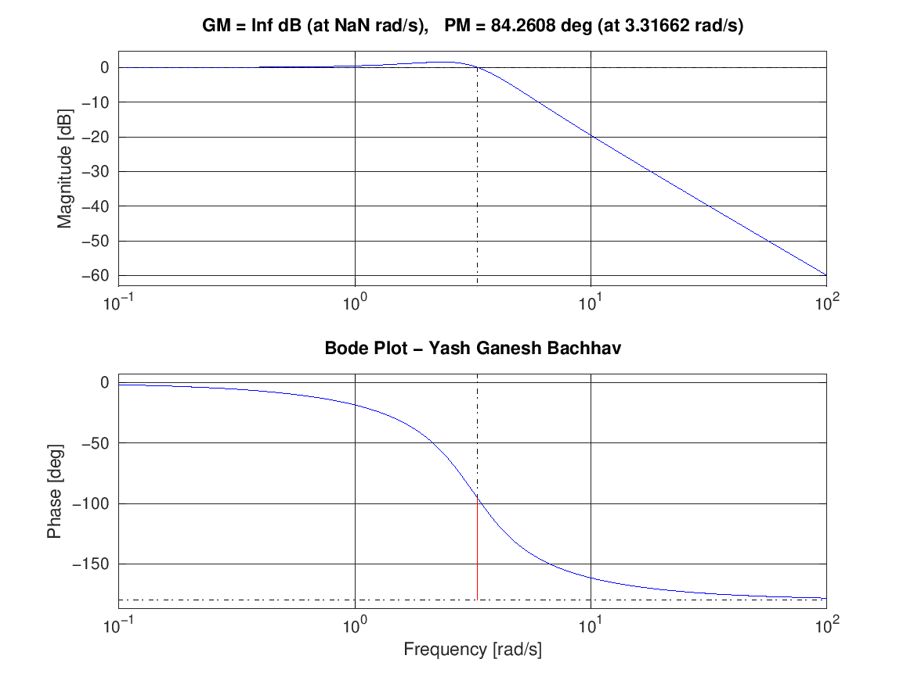
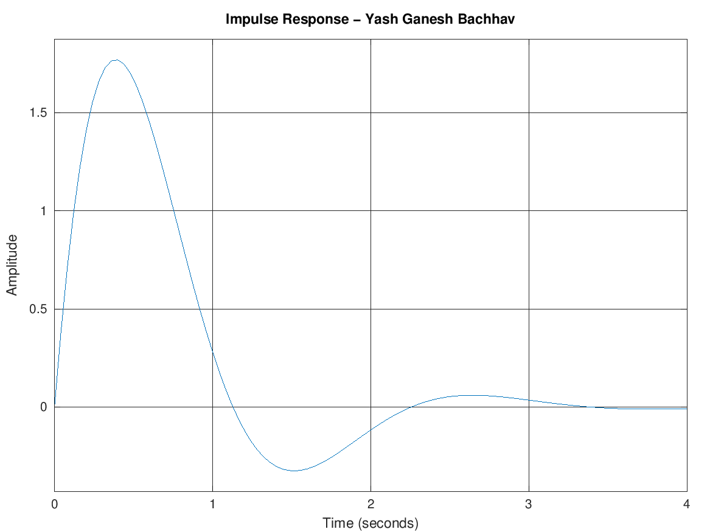
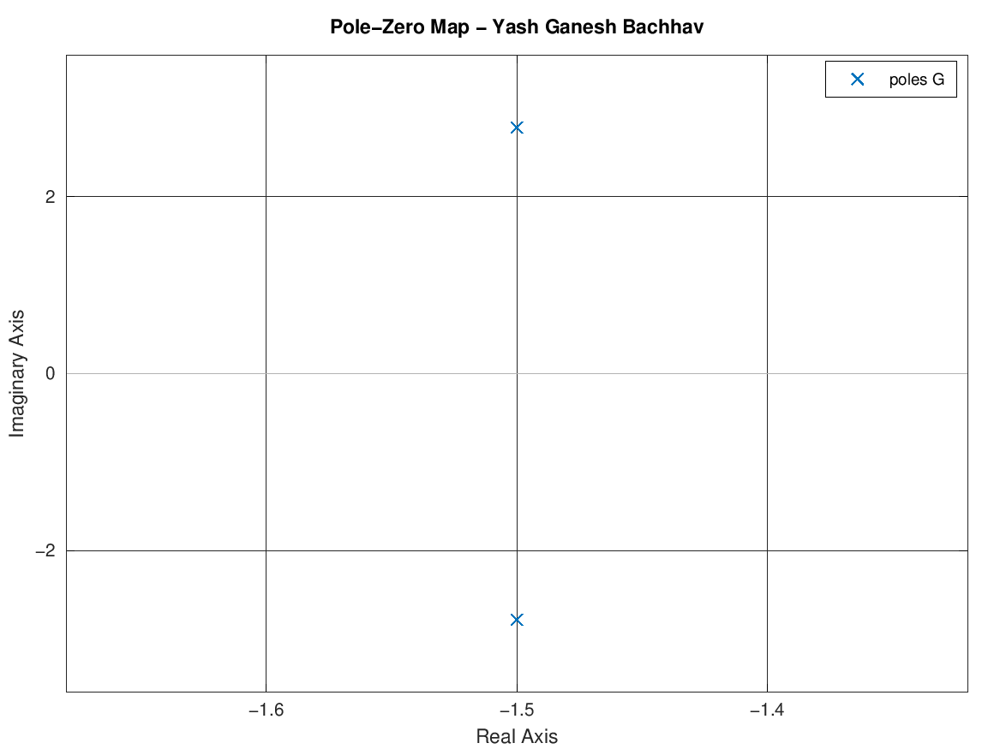

# Transfer Function & Bode Plot Analysis — MATLAB

## Overview
Analysis of a second-order control system using Transfer Function representation. This project plots the **Bode Plot**, **Step Response**, **Impulse Response**, and **Pole-Zero Map** of the system using MATLAB/Octave.

## Transfer Function
```
          10
G(s) = ----------
       s² + 3s + 10
```

## System Properties

| Parameter | Value |
|-----------|-------|
| Natural Frequency (ωn) | 3.1623 rad/s |
| Damping Ratio (ζ) | 0.4743 |
| Rise Time | 0.4885 sec |
| Settling Time | 2.1510 sec |
| Peak Overshoot | 18.34 % |
| Gain Margin | Inf dB |
| Phase Margin | 84.26 deg |

## Plots Generated

### 1. Bode Plot
Shows Magnitude (dB) and Phase (deg) vs Frequency — used to analyze stability margins.



### 2. Step Response
Shows system output when a unit step input is applied.


### 3. Impulse Response
Shows system output when an impulse input is applied.



### 4. Pole-Zero Map
Shows location of poles and zeros in the s-plane — both poles in left half plane = stable system.



## Key Observations
- **Gain Margin = Inf dB** → System is unconditionally stable
- **Phase Margin = 84.26°** → Excellent stability (>45° is good)
- **Both poles in Left Half Plane** → System is stable
- **Damping Ratio = 0.47** → Underdamped system (some overshoot)

## Files

| File | Description |
|------|-------------|
| `Transfer_Function_Bode_Plot.m` | Main MATLAB/Octave script |
| `bode_plot.png` | Bode Plot output |
| `step_response.png` | Step Response output |
| `impulse_response.png` | Impulse Response output |
| `pole_zero_map.png` | Pole-Zero Map output |

## How to Run

### MATLAB Online (Free)
1. Go to [https://matlab.mathworks.com](https://matlab.mathworks.com)
2. Login with Google account
3. Upload `Transfer_Function_Bode_Plot.m`
4. Click **Run**

### Octave Online (Free, No Login)
1. Go to [https://octave-online.net](https://octave-online.net)
2. Paste the code → Click **Run**

### MATLAB Desktop
```matlab
>> run('Transfer_Function_Bode_Plot.m')
```

## Author
**Yash Ganesh Bachhav**
B.E. Electronics & Telecommunication Engineering
LGNSCOE, Nashik | SPPU

- GitHub: [github.com/bachhavyash](https://github.com/bachhavyash)
- LinkedIn: [linkedin.com/in/yash-bachhav-4a54b0253](https://linkedin.com/in/yash-bachhav-4a54b0253)
